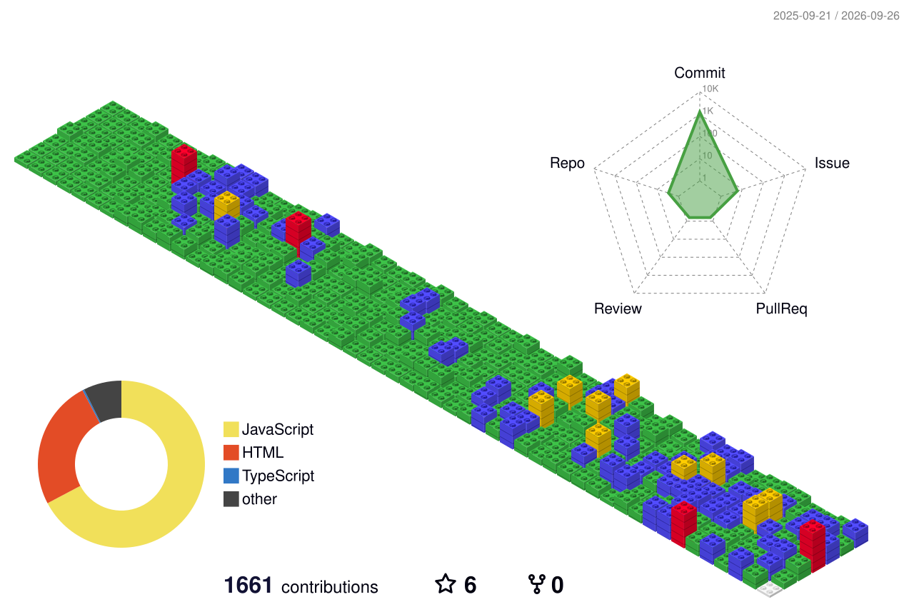

<!--
	

		<picture style='width: 100%;'>
		  <source style='width: 100%;' media="(prefers-color-scheme: light)" srcset="./profile-summary-card-output/transparent/0-profile-details.svg" />
		  <source style='width: 100%;' media="(prefers-color-scheme: dark)"  srcset="./profile-summary-card-output/transparent/0-profile-details.svg" />
		  
		</picture>
	

-->

	<picture>
	  <source style='width: 100%;' media="(prefers-color-scheme: light)" srcset="./profile-3d-contrib/day.svg" />
	  <source style='width: 100%;' media="(prefers-color-scheme: dark)"  srcset="./profile-3d-contrib/night.svg" />
	  
	</picture>

